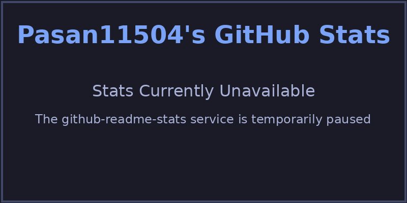
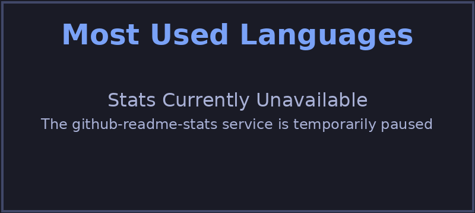

## Hi there 👋

<!--
**Pasan11504/Pasan11504** is a ✨ _special_ ✨ repository because its `README.md` (this file) appears on your GitHub profile.

Here are some ideas to get you started:

- 🔭 I’m currently working on ...
- 🌱 I’m currently learning ...
- 👯 I’m looking to collaborate on ...
- 🤔 I’m looking for help with ...
- 💬 Ask me about ...
- 📫 How to reach me: ...
- 😄 Pronouns: ...
- ⚡ Fun fact: ...
-->
<!-- Animated color-changing divider (replaces ---) -->
<svg xmlns="http://www.w3.org/2000/svg" width="100%" height="12" viewBox="0 0 1200 12" preserveAspectRatio="none" role="img" aria-label="color changing divider">
  <defs>
    <linearGradient id="g" x1="0" y1="0" x2="1" y2="0">
      <stop offset="0%" stop-color="#06b6d4">
        <animate attributeName="stop-color"
                 values="#06b6d4;#7c3aed;#ef4444;#f59e0b;#06b6d4"
                 dur="6s" repeatCount="indefinite" />
      </stop>
      <stop offset="100%" stop-color="#7c3aed">
        <animate attributeName="stop-color"
                 values="#7c3aed;#ef4444;#f59e0b;#06b6d4;#7c3aed"
                 dur="6s" repeatCount="indefinite" />
      </stop>
    </linearGradient>
  </defs>
  <rect x="0" y="0" width="1200" height="12" rx="6" fill="url(#g)" />
</svg>

## Skills

### Programming Languages

<!-- Animated divider -->
<svg xmlns="http://www.w3.org/2000/svg" width="100%" height="10" viewBox="0 0 1200 10" preserveAspectRatio="none" role="img" aria-label="color changing divider">
  <defs>
    <linearGradient id="g2" x1="0" y1="0" x2="1" y2="0">
      <stop offset="0%" stop-color="#06b6d4">
        <animate attributeName="stop-color"
                 values="#06b6d4;#7c3aed;#ef4444;#f59e0b;#06b6d4"
                 dur="6s" repeatCount="indefinite" />
      </stop>
      <stop offset="100%" stop-color="#7c3aed">
        <animate attributeName="stop-color"
                 values="#7c3aed;#ef4444;#f59e0b;#06b6d4;#7c3aed"
                 dur="6s" repeatCount="indefinite" />
      </stop>
    </linearGradient>
  </defs>
  <rect x="0" y="0" width="1200" height="10" rx="5" fill="url(#g2)" />
</svg>

### Frontend

<!-- Animated divider -->
<svg xmlns="http://www.w3.org/2000/svg" width="100%" height="10" viewBox="0 0 1200 10" preserveAspectRatio="none" role="img" aria-label="color changing divider">
  <defs>
    <linearGradient id="g3" x1="0" y1="0" x2="1" y2="0">
      <stop offset="0%" stop-color="#06b6d4">
        <animate attributeName="stop-color"
                 values="#06b6d4;#7c3aed;#ef4444;#f59e0b;#06b6d4"
                 dur="6s" repeatCount="indefinite" />
      </stop>
      <stop offset="100%" stop-color="#7c3aed">
        <animate attributeName="stop-color"
                 values="#7c3aed;#ef4444;#f59e0b;#06b6d4;#7c3aed"
                 dur="6s" repeatCount="indefinite" />
      </stop>
    </linearGradient>
  </defs>
  <rect x="0" y="0" width="1200" height="10" rx="5" fill="url(#g3)" />
</svg>

### Backend

<!-- Animated divider -->
<svg xmlns="http://www.w3.org/2000/svg" width="100%" height="10" viewBox="0 0 1200 10" preserveAspectRatio="none" role="img" aria-label="color changing divider">
  <defs>
    <linearGradient id="g4" x1="0" y1="0" x2="1" y2="0">
      <stop offset="0%" stop-color="#06b6d4">
        <animate attributeName="stop-color"
                 values="#06b6d4;#7c3aed;#ef4444;#f59e0b;#06b6d4"
                 dur="6s" repeatCount="indefinite" />
      </stop>
      <stop offset="100%" stop-color="#7c3aed">
        <animate attributeName="stop-color"
                 values="#7c3aed;#ef4444;#f59e0b;#06b6d4;#7c3aed"
                 dur="6s" repeatCount="indefinite" />
      </stop>
    </linearGradient>
  </defs>
  <rect x="0" y="0" width="1200" height="10" rx="5" fill="url(#g4)" />
</svg>

### Frameworks & Libraries

<!-- Animated divider -->
<svg xmlns="http://www.w3.org/2000/svg" width="100%" height="10" viewBox="0 0 1200 10" preserveAspectRatio="none" role="img" aria-label="color changing divider">
  <defs>
    <linearGradient id="g5" x1="0" y1="0" x2="1" y2="0">
      <stop offset="0%" stop-color="#06b6d4">
        <animate attributeName="stop-color"
                 values="#06b6d4;#7c3aed;#ef4444;#f59e0b;#06b6d4"
                 dur="6s" repeatCount="indefinite" />
      </stop>
      <stop offset="100%" stop-color="#7c3aed">
        <animate attributeName="stop-color"
                 values="#7c3aed;#ef4444;#f59e0b;#06b6d4;#7c3aed"
                 dur="6s" repeatCount="indefinite" />
      </stop>
    </linearGradient>
  </defs>
  <rect x="0" y="0" width="1200" height="10" rx="5" fill="url(#g5)" />
</svg>

### Databases & Data Management

Other related concepts: Data Warehousing, Data Mining, Git

<!-- Animated divider -->
<svg xmlns="http://www.w3.org/2000/svg" width="100%" height="10" viewBox="0 0 1200 10" preserveAspectRatio="none" role="img" aria-label="color changing divider">
  <defs>
    <linearGradient id="g6" x1="0" y1="0" x2="1" y2="0">
      <stop offset="0%" stop-color="#06b6d4">
        <animate attributeName="stop-color"
                 values="#06b6d4;#7c3aed;#ef4444;#f59e0b;#06b6d4"
                 dur="6s" repeatCount="indefinite" />
      </stop>
      <stop offset="100%" stop-color="#7c3aed">
        <animate attributeName="stop-color"
                 values="#7c3aed;#ef4444;#f59e0b;#06b6d4;#7c3aed"
                 dur="6s" repeatCount="indefinite" />
      </stop>
    </linearGradient>
  </defs>
  <rect x="0" y="0" width="1200" height="10" rx="5" fill="url(#g6)" />
</svg>

### Tools & Technologies

Other tooling experience: Cisco Packet Tracer

<!-- Animated divider -->
<svg xmlns="http://www.w3.org/2000/svg" width="100%" height="12" viewBox="0 0 1200 12" preserveAspectRatio="none" role="img" aria-label="color changing divider">
  <defs>
    <linearGradient id="g7" x1="0" y1="0" x2="1" y2="0">
      <stop offset="0%" stop-color="#06b6d4">
        <animate attributeName="stop-color"
                 values="#06b6d4;#7c3aed;#ef4444;#f59e0b;#06b6d4"
                 dur="6s" repeatCount="indefinite" />
      </stop>
      <stop offset="100%" stop-color="#7c3aed">
        <animate attributeName="stop-color"
                 values="#7c3aed;#ef4444;#f59e0b;#06b6d4;#7c3aed"
                 dur="6s" repeatCount="indefinite" />
      </stop>
    </linearGradient>
  </defs>
  <rect x="0" y="0" width="1200" height="12" rx="6" fill="url(#g7)" />
</svg>

## GitHub Stats

